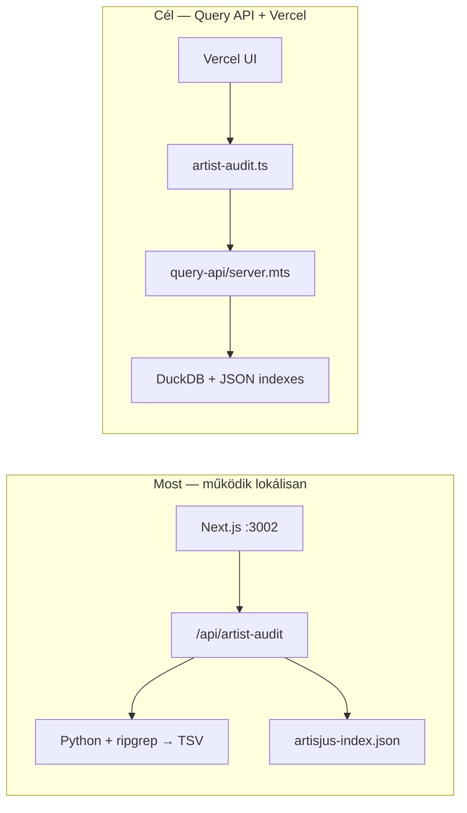

# Handoff — adatgép (másik asztali gép)

**Olvasd el ezt a fájlt először**, ha ezen a gépen dolgozol, ahol a nagy adatfájlok vannak.

Repo: https://github.com/renhorvath/blackboxauditor

---

## Mi ez a projekt?

**Blackbox Auditor** — metaadat-auditor magyar/európai jogdíj-kontextusban:

- **Előadó-ellenőrzés:** Spotify név → MLC unmatched TSV keresés + ARTISJUS azonosítatlan művek egyeztetés
- **ISRC audit** (régebbi flow): credits.fm API batch, `/audit` oldal
- **Cél (következő nagy feladat):** 120+ GB TSV/CSV források **gyors, online lekérdezhető** katalógussá alakítása (DuckDB/Parquet + állandó query API + Vercel UI)

Részletes üzleti kontextus: `music-metadata-audit-projekt-riport.md`

---

## Architektúra (jelenleg vs cél)



---

## Mi van BEKÖTVE (kábelezve) ✅

| Funkció | Fájlok | Függőség |
|---------|--------|----------|
| Előadó audit UI | `components/HomeAuditor.tsx`, `ArtistAuditResults.tsx` | Spotify kereső opcionális |
| Előadó audit API | `app/api/artist-audit/route.ts` → `lib/artist-audit.ts` | `artistName` |
| MLC unmatched scan | `lib/mlc-artist-scan.ts` → `export_artist_mlc_json.py` | `MLC_UNMATCHED_TSV`, `rg` vagy `--no-rg` |
| MLC unclaimed scan | `lib/mlc-artist-scan.ts` → `export_artist_unclaimed_json.py` | `MLC_UNCLAIMED_TSV`, ~7.6 GB |
| MLC cache | `{MLC_HU_DATA_DIR}/hu_artist_scans/{slug}/` | Korábbi scan CSV újrahasználata |
| ARTISJUS index | `lib/artisjus-index.ts`, `npm run artisjus:build-index` | `ARTISJUS_CSV_PATH` → `data/artisjus-index.json` |
| CMO index (AKM, AUME, SENA) | `lib/cmo-index.ts`, `npm run cmo:build-index` | `data/cmo-index.json` |
| ARTISJUS API | `/api/artisjus-match`, `/api/artisjus-artist-search` | Index fájl létezése |
| ARTISJUS enrichment | `lib/artisjus-enrich.ts` | Audit sorokhoz issue-k |
| ISRC audit (credits.fm) | `app/audit/page.tsx`, `lib/credits-fm.ts`, `/api/batch` stb. | `CREDITS_FM_API_KEY` opcionális |
| Spotify | `lib/spotify.ts`, kereső comboboxok | `SPOTIFY_CLIENT_ID/SECRET` |
| MLC batch pipeline | `scripts/mlc/*.py` | Lásd `scripts/mlc/README.md` |

**Előadó-flow adatforrás:** MLC helyi TSV + ARTISJUS index. **Nem** credits.fm (szándékos).

---

## Mi NINCS bekötve ❌ (következő munka)

| Feladat | Állapot |
|---------|---------|
| TSV → Parquet → DuckDB ETL | ✅ `scripts/etl/` — catalog rebuild az adatgépen |
| Query API (Node, 24/7) | ✅ `npm run query-api:start` — `scripts/query-api/README.md` |
| Vercel → backend proxy | ✅ `QUERY_API_URL` + `lib/query-api-client.ts` |
| Cloudflare Tunnel / VPS | **Te telepíted** — tunnel URL → Vercel env |
| Több CMO forrás unified schema | Tervezett |

**Vercel éles:** állítsd be `QUERY_API_URL` + `QUERY_API_KEY`; az adatgépen fusson a query API + tunnel.

**Jelenlegi MLC keresés (adatgép):** DuckDB catalog ms-szinten; legacy rg path fallback.

---

## Repo fájlstruktúra

```
blackbox_auditor/
├── app/
│   ├── page.tsx              # Főoldal — előadó audit
│   ├── audit/page.tsx        # ISRC batch audit (credits.fm)
│   └── api/
│       ├── artist-audit/     # POST { artistName, scope }
│       ├── artisjus-*/       # ARTISJUS keresés
│       ├── batch/            # credits.fm batch
│       └── spotify-*/        # Spotify resolve, discography
├── components/               # UI
├── lib/
│   ├── artist-audit.ts       # Orchestráció: MLC + ARTISJUS
│   ├── mlc-artist-scan.ts    # Python subprocess
│   ├── artisjus-index.ts     # Token index in-memory
│   ├── artisjus-enrich.ts
│   ├── audit-engine.ts       # Issue generálás
│   └── types.ts
├── scripts/
│   ├── mlc/                  # Python: TSV scan, HU filter, MB index
│   └── artisjus/build-index.mjs
├── data/                     # Generált index (gitignore)
├── HANDOFF.md                # ← EZ A FÁJL
├── DATA_SETUP.md             # Adatmappa, env, git szabályok
├── music-metadata-audit-projekt-riport.md
└── .env.example
```

**Nincs a repóban (adatgépen külön):**

```
.../music-rights/raw/mlc/unmatchedresources.tsv     # ~121 GB
.../music-rights/raw/artisjus/*.csv
.../music-rights/derived/mlc-hu/                    # exportok, scan cache
```

---

## Első lépések ezen a gépen

```bash
git clone https://github.com/renhorvath/blackboxauditor.git
cd blackboxauditor
npm install
cp .env.example .env.local
```

`.env.local` — **a te tényleges pathjaidra** állítsd:

```env
MLC_UNMATCHED_TSV=<unmatchedresources.tsv>
MLC_UNCLAIMED_TSV=<unclaimedmusicalworkrightshares.tsv>
MLC_HU_DATA_DIR=<derived mappa, pl. scan cache + exportok>
ARTISJUS_CSV_PATH=<artisjus_azonositatlan_muvek_2025.csv>
ARTISJUS_INDEX_PATH=./data/artisjus-index.json

SPOTIFY_CLIENT_ID=...
SPOTIFY_CLIENT_SECRET=...
```

```bash
# ARTISJUS index (pár perc)
npm run artisjus:build-index

# Dev szerver
npm run dev
# → http://localhost:3002
```

**Előfeltételek:** Node 20+, `python3`, `pip install ahocorasick` (MLC scriptekhez), `rg` (ripgrep).

Teszt: előadónév keresés a főoldalon (pl. ismert magyar előadó). Első MLC scan lassú lehet.

---

## Env változók összefoglaló

| Változó | Kötelező | Mihez |
|---------|----------|-------|
| `MLC_UNMATCHED_TSV` | Unmatched felvételek (121 GB) | Igen |
| `MLC_UNCLAIMED_TSV` | Unclaimed work shares (~7.6 GB) | Igen |
| `MLC_HU_DATA_DIR` | Ajánlott | Scan cache, pipeline output |
| `ARTISJUS_CSV_PATH` | ARTISJUS-hoz | Nyers CSV |
| `ARTISJUS_INDEX_PATH` | ARTISJUS-hoz | Generált JSON (default: `./data/artisjus-index.json`) |
| `SPOTIFY_*` | Spotify keresőhöz | |
| `CREDITS_FM_API_KEY` | `/audit` oldalhoz | Opcionális |
| `QUERY_API_URL` | Még nem | Későbbi online backend |

---

## Következő fejlesztési prioritás (adatgépen)

1. **ETL:** `unmatchedresources.tsv` → Parquet (csak keresett oszlopok) → DuckDB `catalog.duckdb`
2. **Query API:** kis HTTP szerver DuckDB felett (`/search/isrc`, `/search/artist`)
3. **MLC scan cseréje:** `lib/mlc-artist-scan.ts` ne rg-t spawnoljon, hanem DuckDB-t hívjon
4. **Online:** Vercel proxy + Tunnel/VPS
5. **Unified search:** ARTISJUS + MLC + egyéb CMO egy schema alatt

---

## Prompt a Cursornak ezen a gépen

Másold be új chatbe:

```
Olvasd el a repo HANDOFF.md, DATA_SETUP.md és music-metadata-audit-projekt-riport.md fájljait.

Ez az adatgép: itt vannak a nagy fájlok (MLC TSV ~121GB, ARTISJUS CSV-k).
A .env.local-ben beállítottam a pathokat.

Érted a fájlstruktúrát és a feladatot?
- Mi van már bekötve (előadó audit, ARTISJUS index, MLC rg scan)
- Mi a cél (DuckDB + online query API + Vercel)

Ha érted, mondd vissza röviden a saját szavaiddal, aztán kezdjük az ETL vázát (TSV → Parquet → DuckDB).
```

---

## Git szabályok

- **Soha ne commitolj:** `.env.local`, `*.tsv`, `Artisjus azonosítatlan művek/`, `*.duckdb`, `data/artisjus-index.json`
- Részletek: `DATA_SETUP.md`
