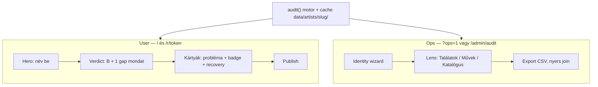

# UI roadmap — A (katalógus) × B (black box) integráció

> Társdokumentumok: `docs/audit_pipeline.md`, `docs/cisac_probe_findings.md`
>
> Cél: egy termék, egy user flow; a háttérben két adatvilág (dokumentált metaadat vs.
> azonosítatlan listák), összevetve gap-analízissel. A user a black box miatt jön;
> az A oldal minőséget és prioritást ad — nem külön termék.

---

## 1. Két világ, egy képernyő

| Világ | Kérdés | Források (ma / terv) |
|-------|--------|----------------------|
| **A — katalógus** | Mi van már dokumentálva? | Spotify, credits.fm, CISAC/ISWC, MLC matched |
| **B — black box** | Hol van azonosítatlan / kifizetetlen? | ARTISJUS, MLC unmatched/unclaimed, EU CMO, EJI |
| **Gap (A×B)** | Mi a különbség? | consolidate + gaps (SNYL scriptek → később `lib/audit-core`) |

**Termékígéret (user):** *„Megnézzük, szerepelsz-e kifizetetlen vagy azonosítatlan listákon.”*  
**Differenciátor (ops):** *„Nem csak listázunk — tudjuk, mi hiányzik a regisztrációból.”*

---

## 2. Ki mit lát



| Elem | User | Ops |
|------|------|-----|
| Black box találatok (B) | fő tartalom | + nyers ID, forrás-blokkok |
| Metaadat (A) | 1–2 badge / mondat | teljes catalog tábla, IPI, CISAC |
| Gap prioritás | „először ezek” rendezés | P0/P1/P2, join konfidencia |
| Identity wizard | soha | alias, jogi név, IPI választás |
| Recovery playbook | lágy lépések | + operatorNotes, pre-fill export |

---

## 3. Jelenlegi UI — hol tartunk

| Komponens | Ma | Oldal |
|-----------|-----|-------|
| `HomeAuditor` | név → POST `/api/artist-audit` | B |
| `ArtistAuditResults` | `onlyProblems` default, forrás + névvariáns szűrő | B |
| `ArtistAuditRowCard` | `rowHasPayoutProblem`, recovery playbook | B |
| `ArtistAuditSummaryHeader` | forrás-chippek (ARTISJUS×N, MLC×N…) | B |
| `/audit` + ISRC flow | credits.fm batch | A (külön oldal) |
| `PublishedReportView` | publisholt B findings | B |
| `OperatorConsole` | report lista, case státusz | ops (ügykezelés, nem audit) |

**Hiányzik:** gap badge, A összesítő, mű-szintű grouping, identity wizard, catalog lens.

---

## 4. Cél adatmodell (fokozatos)

Ma: `AuditRow[]` — felvétel-centrikus, B-vel telített.

Cél (köztes lépés — UI még `AuditRow`-t renderelhet):

```ts
/** lib/audit-core/gap-types.ts — terv */
export type GapPriority = "P0" | "P1" | "P2";

export type GapKind =
  | "blackbox_only"           // B találat, A gyenge (nincs ISWC / nincs match)
  | "listed_and_registered"     // A✓ + B✓ — erős recovery (matching hiba)
  | "missing_iswc"              // ISRC van, ISWC nincs
  | "missing_ipi"               // writer IPI hiány MLC-n
  | "share_incomplete"          // A oldal: share probléma
  | "name_only_match"           // csak fuzzy név, alacsony konfidencia
  | "catalog_clean";            // A rendben, B nincs — usernek rejtett

export interface GapBadge {
  kind: GapKind;
  priority: GapPriority;
  label: string;               // user-facing rövid szöveg
  catalogHint?: string;        // opcionális A mondat
  confidence: "high" | "fuzzy" | "wizard";
}

/** Későbbi: WorkBucket — mű-szintű grouping */
export interface WorkBucket {
  workKey: string;
  title: string;
  iswc?: string;
  recordings: AuditRow[];
  gap: GapBadge;
}
```

**Szabály:** user publish csak `P0`/`P1` + `blackbox_only` | `listed_and_registered` | `name_only_match` (ha ops jóváhagyta).

---

## 5. UI fázisok

### Fázis 1 — Gap badge a meglévő kártyán (Sprint 1)

**Cél:** A és B láthatóan összekapcsolódik, új oldal nélkül.

**Új komponens:** `GapBadgeStrip` — 0–3 chip a kártya summary alatt.

| `GapKind` | User label (HU) | Mikor |
|-----------|-----------------|-------|
| `missing_iswc` | ISWC hiányzik | van ISRC, credits.fm nem ad ISWC-t |
| `listed_and_registered` | Listán, de regisztrálva is | B + ISWC/MLC matched |
| `name_only_match` | Csak név egyezés | `isUncertainNameMatch` |
| `missing_ipi` | Szerzői IPI hiány | MLC issue `missing_ipi_mlc` |
| `share_incomplete` | Share hiányos | share audit issue |

**Érintett fájlok:**

- `lib/audit-core/gap-types.ts` (új)
- `lib/audit-core/derive-gap-badges.ts` (új) — `AuditRow` → `GapBadge[]`
- `components/GapBadgeStrip.tsx` (új)
- `components/ArtistAuditRowCard.tsx` — badge strip
- `components/PublishedFindingCard.tsx` — `finding.gapBadges` snapshot
- `lib/report-types.ts` — publish snapshot bővítés

**Ops bővítés (ugyanott, `?ops=1`):** badge alatt `confidence` + join forrás monospace.

### Fázis 2 — Összefoglaló fejléc (Sprint 2)

**`ArtistAuditSummaryHeader` bővítés:**

```
Sor 1 (B, marad):  „8 dal kifizetetlen listán”
Sor 2 (A+gap, új): „5 dalnak nincs ISWC · 2 listás dal regisztrálva is”
```

Opcionális portfolio chip sor (ops / manager):

- Spotify: N felvétel (ha `scope: full` / scrape kész)
- ISWC: M mű
- Érintett black box: K

**Backend:** credits.fm batch a talált ISRC-kre audit után (`POST /api/batch` — már létezik).

### Fázis 3 — Lens váltó (Sprint 3)

A meglévő `onlyProblems` | `Minden névegyezés` toggle mellé **grouping lens**:

| Lens | ID | Tartalom | Alapértelmezés |
|------|-----|----------|----------------|
| Találatok | `findings` | mai `AuditRow` lista | user |
| Művek szerint | `by_work` | `WorkBucket` csoport | manager / publish |
| Katalógus | `catalog` | A oldal táblázat | ops only |

**Új komponensek:** `AuditLensToggle`, `CatalogTable`, `WorkBucketCard`.

**Feltétel:** catalog lens csak ha `meta.catalogReady === true` (Spotify + legalább egy A forrás).

### Fázis 4 — Identity wizard (Sprint 4, ops only)

Modal vagy `/ops/audit/[slug]` a `audit_pipeline.md` Fázis 0 alapján:

1. Alias exclude megerősítés (pl. Mr. Bizz)
2. Jogi név választás (writer szavazás)
3. IPI választás (CISAC szavazás — `cisac_probe_findings.md`)

**Gate:** audit `status: "pending_identity"` amíg wizard nincs lezárva. User flow: async („ellenőrizzük”).

### Fázis 5 — Publish + report (Sprint 5)

- Findings rendezés: `gap.priority` → `gap.kind`
- Snapshot: `gapBadges[]`, `catalogHint`, `priority`
- Ops: export `actionable_gaps.csv` szint

---

## 6. Wireframe — komponens szint

### 6.1 `HomeAuditor` (változatlan hero)

```
┌────────────────────────────────────────┐
│ Van zenéd, aminek a jogdíja…           │
│ [ Előadó neve_______________ ]         │
│ [ Jogdíj-ellenőrzés indítása ]         │
│ ▸ Spotify kereső (opcionális)          │
│ ▸ Egy dal / Spotify link               │
└────────────────────────────────────────┘
```

### 6.2 `ArtistAuditResults` (Fázis 1–2 után)

```
┌────────────────────────────────────────┐
│ ArtistAuditSourceCoverage              │
│ Eredmény: Moldvai Márk                 │
│ 8 dal kifizetetlen listán              │  ← B verdict
│ 3 dalnak nincs ISWC                    │  ← A+gap (új)
│ [8× ARTISJUS] [4× GVL] …               │
├────────────────────────────────────────┤
│ Névvariáns: [Moldvai Márk ✓] …         │
│ Forrás: [ARTISJUS] [MLC] …             │
│ [Kifizetetlen listán] | Minden         │
│ Lens (ops): Találatok | Művek | Kat.   │  ← Fázis 3
├────────────────────────────────────────┤
│ ┌─ ArtistAuditRowCard ─────────────┐  │
│ │ ⚠ 1849_HALÁLBÜNTETÉS               │  │
│ │ Magyarországon: ARTISJUS …         │  │
│ │ [ISWC hiányzik] [P1]               │  │  ← GapBadgeStrip
│ │ ▸ Részletek (2 forrás)             │  │
│ │   ▸ Metaadat (ops)                 │  │  ← Fázis 1 ops
│ │   ▸ Recovery playbook              │  │
│ └────────────────────────────────────┘  │
├────────────────────────────────────────┤
│ [Jelentés megnyitása] [Publish…]       │
└────────────────────────────────────────┘
```

### 6.3 `ArtistAuditRowCard` — Részletek blokk (bővített)

```
Részletek (2 forrás)
├── [B] ARTISJUS — azonosítatlan, SEFAA, …
├── [B] GVL — Sendemeldung …
└── [A] Metaadat (ops)                    ← Fázis 1
    ISRC: HU…  ISWC: —  IPI: —
    credits.fm: no_iswc  MLC: unmatched
    join: fuzzy_title  confidence: fuzzy
```

### 6.4 `PublishedFindingCard` (publish snapshot)

User látható:

- `laymanSummary` (marad)
- `gapBadges` → max 2 chip, emberi label
- recovery playbook (marad)
- `publicNote` / státusz (marad)

Rejtett usernek: `confidence`, nyers join, operatorNotes.

---

## 7. API / backend sorrend (UI-t táplálja)

| # | Backend | UI fázis |
|---|---------|----------|
| 1 | `derive-gap-badges.ts` + credits.fm ISRC enrich audit után | Fázis 1 |
| 2 | összesítő számlálók A-ra (`summary.catalogGaps`) | Fázis 2 |
| 3 | `WorkBucket` grouping (`consolidate` port) | Fázis 3 |
| 4 | `ArtistContext` + identity API | Fázis 4 |
| 5 | CISAC cache olvasás query-api-ból | Fázis 3–4 |

**Ne hívd CISAC-ot user kattintásra** — cache: `data/artists/{slug}/cisac/`.

---

## 8. Sprint 1 — konkrét feladatlista

Implementálási sorrend (minimális diff):

1. **`lib/audit-core/gap-types.ts`** — enumok + `GapBadge` interface
2. **`lib/audit-core/derive-gap-badges.ts`** — szabályok:
   - `rowHasPayoutProblem` + nincs `iswc` → `missing_iswc`
   - B + `iswc` → `listed_and_registered`
   - `isUncertainNameMatch` → `name_only_match`
   - `missing_ipi_mlc` issue → `missing_ipi`
3. **`components/GapBadgeStrip.tsx`** — chip UI
4. **`ArtistAuditRowCard`** — strip a `laymanSummary` alatt
5. **`lib/ops-mode.ts`** — `isOpsMode()` = `?ops=1` vagy `OPS_UI=true` env
6. Ops meta blokk a kártya részleteiben (üres ha nem ops)
7. **Opcionális:** `POST /api/artist-audit` után credits.fm batch háttérben (ha van ISRC)

**Nem Sprint 1:** WorkBucket, wizard, catalog lens, publish schema change (Fázis 5).

---

## 9. `/audit` ISRC oldal — hosszú táv

Ne tartsuk két termékként:

- Rövid táv: marad `/audit` + hero „Egy dal” details
- Közép táv: ISRC audit = egy sor mélyítés a fő flow-ban
- A credits.fm batch egy helyen fusson (artist-audit enrich)

---

## 10. Összefoglaló

| Döntés | Irány |
|--------|-------|
| Terméknév / hero | black box ígéret marad |
| A oldal | badge + ops részlet, nem külön landing |
| B oldal | fő lista, publish alapja |
| Gap | prioritás + rendezés + user mondat |
| Ops | wizard + catalog lens + export |
| Implementáció | Sprint 1: gap badge, minimális backend |

Következő commit után: Sprint 1 kód (`gap-types` + `GapBadgeStrip` + kártya integráció).
